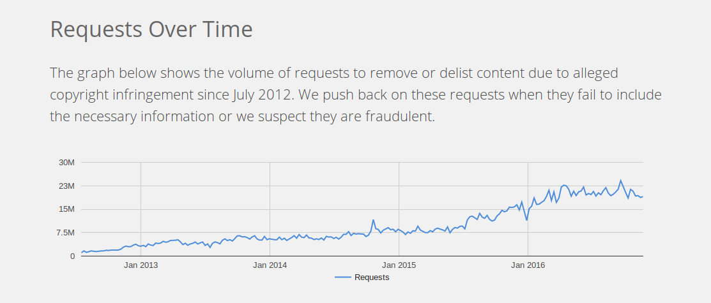

O combate aos conteúdos pirata é cada vez maior e a **_Google_** que o diga. A gigante da _internet_ ultrapassou, pela primeira vez num ano, a marca de mil milhões de pedidos de remoção de _links_ que alegadamente continham este tipo de ficheiros.

Os números fazem parte do [_Relatório de Transparência_](https://www.google.com/transparencyreport/removals/copyright/?hl=en) da empresa. Mais de noventa porcento do total foram removidos.

O _site_ [_The Torrent Freak_](https://torrentfreak.com/google-asked-to-remove-a-billion-pirate-search-results-in-a-year-161128/?utm_source=feedburner&utm_medium=feed&utm_campaign=Feed%3A+Torrentfreak+%28Torrentfreak%29) analisou os números e constatou um aumento significativo, comparativamente com os anos anteriores. Do total de dois mil milhões de pedidos recebidos desde março de 2011, metade corresponde aos últimos doze meses.

No topo da lista de domínios com mais _links_ removidas está o site _4shared.com_, seguido do _rapidgator.net_ com sensivelmente metade do anterior.

Se a tendência se mantiver, podemos esperar um aumento ainda maior no número de pedidos de remoção de conteúdos pirata no final do próximo ano.
