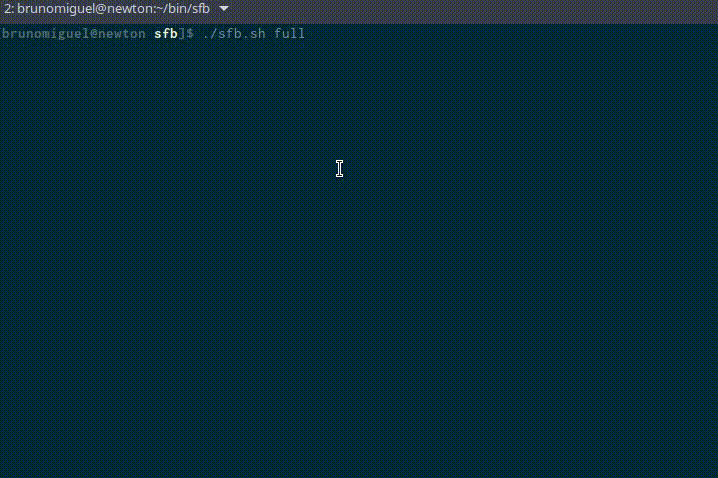

Lembraste do famoso - e efémero - jogo **_[Flappy Bird](https://pt.wikipedia.org/wiki/Flappy_Bird)_**? O original pode já não existir, mas este _time waster_ viciante deu origem a vários clones para diferentes plataformas.

Um destes clones é o _**Sfb**_. Só que este é um pouco diferente, porque é feito para ser jogado na linha de comandos. Se usas _Windows_, não penses que ficaste de fora, porque a versão 10 do sistema operativo da _Microsoft_ já [emula alguns componentes](http://www.zdnet.com/article/ubuntu-and-bash-arrive-on-windows-10/) do _[Ubuntu](https://www.ubuntu.com)_, por isso é possível que tenhas o [_sed_](https://www.gnu.org/software/sed/) e a [bash](https://www.gnu.org/software/bash/) para poderes passar horas agarrado às máquinas.

### Como instalar

Para instalares o jogo, necessitas do _[Git](https://git-scm.com/)_. Caso não tenhas esta aplicação, podes visitar o repositório do jogo no _[Github](https://github.com/ValeriyKr/sfb)_ e descarregá-lo como ficheiro _zip_.

Assumindo que tens o _Git_ instalado, basta executares a seguinte sequência de comandos: `git clone [https://github.com/ValeriyKr/sfb.git](https://github.com/ValeriyKr/sfb.git); cd sfb/`

### Como jogar

Abrir o jogo é simples. Necessitas apenas de executar o ficheiro _sfb.sh_. Mais uma vez, na linha de comandos, basta: `./sfb.sh`

Atenção que este comando assume que usaram os dois anteriores. Para correr o ficheiro é preciso estar na pasta onde ele está guardado.

Depois de estar a correr, tal como na versão original, só podes fazer o pássaro subir. Para isso, usas a tecla _k_ do teclado.

### Modos de jogo

Existem três modos de jogo disponíveis. O padrão, _none_, é monocromático; o _light_ acrescenta alguns elementos coloridos; e o _full_, muito honestamente, parece uma _trip_ psicadélica com tanta cor.

O _gif_ abaixo mostra como eles são:

\[caption id="attachment\_242049" align="alignnone" width="718"\] Os modos de jogo do sfb\[/caption\]
