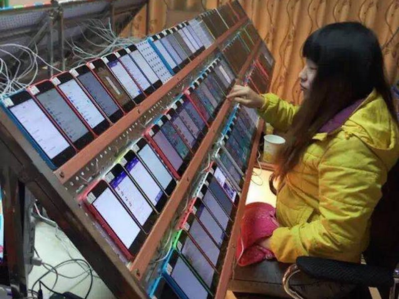

Os _rankings_ das a_pp stores_ são uma das formas de procurarmos um aplicação que nos seja útil e popular. A combinação destes dois fatores resulta naquilo que podemos considerar a escolha acertada. Mas devemos mesmo confiar nestes _tops_?

A seguinte imagem, já com um ano, tornou-se viral na rede social chinesa _Weibo_, e mostra uma jovem que foi identificada como sendo uma _clickfarmer._ A sua função é instalar, desinstalar e voltar a instalar, repetidamente, diversas aplicações em vários equipamentos para inflacionar os _rankings_ nas a_pp stores_.

\[caption id="attachment\_242653" align="alignnone" width="800"\] Clickfarmer a manipular rankings das lojas de aplicações.\[/caption\]

O serviço, com alegada capacidade para colocar uma aplicação no top 10 das _apps_ gratuitas, tem um suposto custo inicial de onze mil dólares, seguindo-se o pagamento de sessenta e cinco mil dólares semanais para manutenção do _ranking_.

No mercado _online_ chinês _[Taobao](https://world.taobao.com/search/search.htm?_ksTS=1483623578777_336&from=tbsearch&_input_charset=utf-8&navigator=all&json=on&q=%E5%88%B7%E6%A6%9C%20app%20store&callback=__jsonp_cb&abtest=_AB-LR517-LR854-LR895-PR517-PR854-PR895)_ existem várias dezenas de fornecedores. Se visitares a hiperligação deste parágrafo, vais reparar que a maioria tem o custo de um _yuan_ (aproximadamente 0,14 euros), deixando provavelmente as negociações dos valores e duração para serem feitas através de _chat_.

Não há confirmação oficial de que se trata de uma _clickfarmer_, mas o facto de ter vários equipamentos iPhone 5C à frente, e de ser visível uma outra mesa que parece ser igual, torna essa desconfiança numa possibilidade bem real. Em 2012, o _site_ _Venture Beat_ [abordou](http://venturebeat.com/2012/07/03/apples-crackdown-on-app-ranking-manipulation/) esta questão e as dificuldades inerentes à deteção deste tipo de aldrabices, e cita um caso de uma empresa que foi banida da _iTunes Store_ por utilizar estas práticas menos corretas.

#### Não só de _rankings_ adulterados vivem os _scammers_

Não são apenas os _rankings_ das _apps_ a ser alvo de deturpação. Até mesmo as análises às aplicações e os comentários que recebem são adulteradas. Esta questão já chegou a ser [levantada](https://discussions.apple.com/thread/7138476?start=0&tstart=0) na página de suporte da _Apple_.

Isto obrigou a _Google_ e a _Apple_ a alterar diversas vezes os algoritmos utilizados para os _tops_. Uma solução que nem sempre é a melhor, já que atualmente esses mesmos algoritmos parecem dar primazia às avaliações dos utilizadores e assim abrem as portas a mais aldrabices.

Tudo isto é especulativo, bem sei, mas a verdade é que estas empresas têm aplicado medidas para minimizar isso, por isso é bem possível que aconteça e até a uma escala maior do que se possa pensar.

#### _App stores_: um campo minado

Talvez possas achar um exagero da minha parte e que pareço um anunciante da desgraça e do fim do mundo, mas garanto-te que não é. Há uns tempos tive esta discussão com um dos [meus](https://twitter.com/brunomiguel) contactos no Twitter, o [@jmcest](https://twitter.com/jmcest), precisamente sobre isso. Ele escreveu, e com razão, que escolher aplicações na _Play Store_ é como andar num campo minado. O mesmo se aplica a outras a_pp stores_.

<blockquote class="twitter-tweet">
<a href="https://twitter.com/brunomiguel">@brunomiguel</a> Yep, Google Play tastes like a mine field, more so if most users expect otherwise when they start installing apps…
— jmce (@jmcest) <a href="https://twitter.com/jmcest/status/763205719541841921">August 10, 2016</a></blockquote>

Dou-te um exemplo: em abril de 2016, investigadores da firma de segurança russa _Dr. Web_ [detetaram](http://vms.drweb.com/virus/?_is=1&i=8020079) o mesmo _trojan_ em 104 aplicações da _Play Store_. Estas _apps_ faziam-se passar por editores de imagem, _wallpapers_ animados, entre outros, mas a maioria delas nem sequer fazia o que tinha na descrição.

Assim que era feita a instalação de uma destas aplicações maliciosas, o _malware_ começava imediatamente a recolher 30 tipos diferentes de informação sobre o utilizador e enviava isso para um servidor remoto. Mais, apresentava _popups_ para incentivar ao download de mais _apps_ maliciosas.

E tu, confias nos _rankings_ e comentários da a_pp store_ que utilizas?
