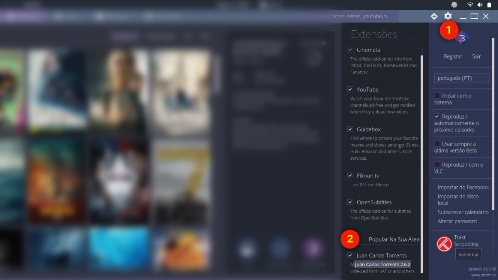

Se gostas de ver filmes e séries, vais ficar viciado no [**Stremio**](http://strem.io). Este programa é semelhante ao **Popcorn Time**, mas tem mais algumas funcionalidades que te vão conquistar e possivelmente torná-lo no teu novo _mediacenter_.

O programa permite-te pesquisar filmes e séries, só que a configuração padrão não permite o _download_ gratuito. Deves aceder às definições, ativar o _plugin_ _Juan Carlos Torrents_ e o _download_ dos conteúdos passa a ser feito através de _bittorrent_.

\[caption id="attachment\_242525" align="aligncenter" width="1200"\] Como ativar download por bittorrent\[/caption\]

O **Stremio** também inclui legendas e acesso aos _trailers_. E é aqui que terminam as semelhanças com o _Popcorn Time_.

A aplicação integra-se com o _iTunes_, _Amazon_, _Google Play_ e _Voodo_, para possibilitar a compra dos filmes e séries. Se utilizas algum destes serviços, ficas com mais uma opção de acesso; caso contrário, tens disponível uma forma de adquirir legalmente os conteúdos.

Podes também ver conteúdos do _Youtube_, _Netflix_, _Twitch_ e até do próprio _Popcorn Time_. Tudo isto com _[plugins](http://addons.strem.io/)_.

A funcionalidade mais interessante é, no entanto, a transmissão dos conteúdos multimédia que visualizares para a tua _Smart TV_, _AppleTV_, _Chromecast_, _smartphone_ e _tablet_. As tuas sessões de cinema vão ficar bem mais interessantes e com muito mais oferta disponível de forma acessível.

O _Stremio_ está disponível para _Linux_, _macOS_ e _Windows_. Necessitas apenas de aceder ao _site_ para fazeres o _**[download](http://www.strem.io/)**_.
