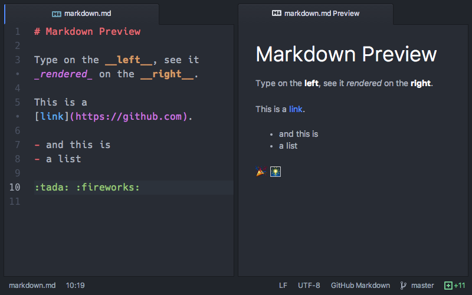

O _Evernote_ é um serviço conhecido por ser um autêntico bloco de notas. No entanto, que aconteceria aos teus conteúdos se a empresa decidisse fechar portas ou descontinuar o produto? O **Standard Notes** quer resolver este problema, utilizando um formato de ficheiro cuja norma é aberta e está disponível para qualquer pessoa implementar.

Assim podes guardar os teus apontamentos e, com isso, garantir que a tua informação ganha longevidade, portabilidade e que a podes usar em qualquer outro serviço que implemente a mesma norma.

O _Standard Notes_ aposta na simplicidade. A aplicação utiliza um campo para o título da nota e outro para o conteúdo. A organização é feita através de _tags_, que também são utilizadas, juntamente com o conteúdo dos apontamentos, para a pesquisa da informação.

A segurança não foi esquecida. Todas as tuas notas são encriptadas no dispositivo onde são criadas antes de servem enviadas para o servidor. Esse servidor pode ser o do _Standard Notes_, o teu ou o de outro fornecedor que o utilize. Isto só é possível porque, tanto as aplicações para criar e gerir as notas, como o servidor que guarda a informação, são _open source_.

O facto de ser simples não significa falta de modernismo. A aplicação gera uma _link_ para cada nota que pretendas partilhar, e podes até partilhar uma _tag_. Isto pode ser útil para, por exemplo, criares um _blog_ apenas com as notas que têm uma determinada palavra-chave associada, ou para um trabalho de grupo.

A cereja no topo do bolo é o suporte para [_markdown_](http://daringfireball.net/projects/markdown/syntax). Esta é uma linguagem _markup_ simples, em que a formatação é feita através de caracteres especiais. Por exemplo, se colocares uma palavra com dois asteriscos antes e dois asteriscos depois, ela fica a negrito. Fica um exemplo na imagem abaixo.

\[caption id="attachment\_243644" align="alignnone" width="800"\] Exemplo de markdown. (Imagem: Atom)\[/caption\]

### O que são normas abertas?

O _site_ [DRM Portugal](https://drm-pt.info/2016/09/18/html-eme-e-normas-abertas/) tem uma lista de cinco requisitos que definem uma norma aberta:

1. Sujeitas a escrutínio público completo e sem restrições de uma forma igualmente disponível a todas as partes;
2. Sem nenhum componente ou extensão que tenha dependências em formatos ou protocolos que não cumpram, eles próprios, a definição de uma Norma Aberta;
3. Livres de cláusulas legais ou técnicas que limitam a sua utilização por qualquer parte ou em qualquer modelo de negócio;
4. Geridas e desenvolvidas continuamente de forma independente de um único fornecedor num processo aberto à igual participação de competidores e outras partes;
5. Disponível em múltiplas implementações completas por fornecedores competidores, ou como uma implementação completa disponível de igual forma a todas as partes.

### _Download_

O Standard Notes está disponível para _Linux_, _macOS_, _Windows_ e _iOS_. Existe também uma versão _web_ da aplicação. Os utilizadores de _Android_ terão de aguardar mais um pouco pela aplicação para esta plataforma.

\[su\_button url="https://standardnotes.org/" target="blank" style="flat" icon="icon: cloud-download" rel="nofollow"\]Download\[/su\_button\]
