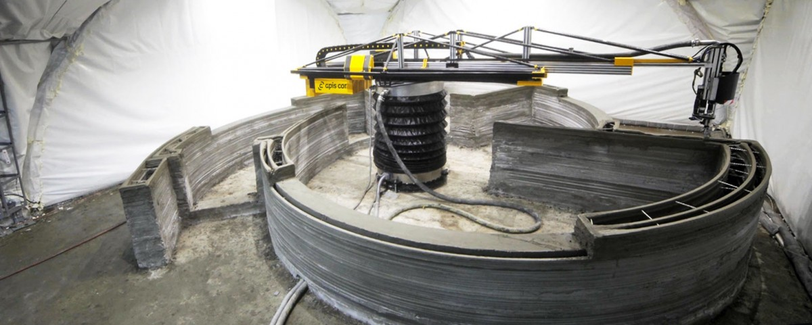

A empresa [**_Apis Cor._**](http://apis-cor.com/en/) desenvolveu a primeira impressora 3D para a construção de edifícios, que realiza todo o trabalho no local e em tempo recorde. Para demonstrar o conceito, imprimiram um casa na Rússia, com 37 metros quadrados, numas impressionantes 24 horas e com um custo de 10 mil dólares (sensivelmente 9 mil e quinhentos euros).

A casa modelo construída possui um _hall_ de entrada, casa de banho, sala de estar e cozinha. A durabilidade, garantem, é de 175 anos.

https://www.youtube.com/watch?v=xktwDfasPGQ

A empresa afirma que o seu equipamento necessita de apenas duas pessoas para ser operado. As suas funções são a operação do equipamento e o abastecimento dos materiais usados na impressão. No consumo energético, produz um gasto de 8 _kW_, que a _Apis Cor._ diz ser idêntico a cinco chaleiras elétricas a trabalhar em simultâneo.

O projeto da _Apis Cor._ vem revolucionar o mercado da construção, aumentando a rapidez e diminuindo os custos. No final é sempre necessário alguns acabamentos manuais, como a colocação de janelas e portas no local, isolamento e a pintura.

\[caption id="attachment\_249132" align="alignnone" width="1200"\] A impressora em funcionamento\[/caption\]

Um dos objetivos da empresa, de acordo com o seu fundador, **Nikita Chen-yun-tai**, é a construção de casas amigas do ambiente e, no futuro, ajudar a construir os primeiros edifícios da colonização marciana.

Se quiseres saber mais sobre este projeto inovador, visita o _[blog](http://apis-cor.com/en/about/news/first-house)_ da empresa. Lá, encontras uma explicação técnica detalhada sobre as fases do projeto e os parceiros que colaboraram nele.
