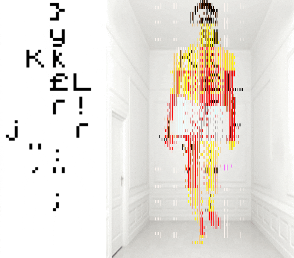

Na era Trump, qualquer pessoa que seja classificada de diferente está sujeita a um “[tratamento especial”](http://www.theverge.com/2017/1/30/14438280/trump-border-agents-search-social-media-instagram) das autoridades, que inclui coisas estapafúrdias como a revista dos equipamentos digitais, acesso às contas nas redes sociais, entre outras coisas orwellianas. Até podes ser um astronauta de nacionalidade americana que trabalha para a NASA, como **Sidd Bikkannavar**, que não te livras deste “[tratamento VIP”](https://www.rt.com/usa/377232-nasa-scientist-detained-airport/) das autoridades. Tudo em nome da “segurança”, é o que nos dizem.

Isto tem-se passado tudo nos Estados Unidos da América - ou como diz _\[muito bem\]_ a nossa editora, [Cátia Rocha](https://espalhafactos.com/author/catia-rocha/), no “_país da falta de noção_”. Esta tendência poderá não chegar a Portugal. Ou não chegar tão cedo, caso o extremismo continue a crescer na Europa e no mundo.

Independentemente disso, convém sempre saber como podes proteger a tua informação e as tuas fontes, seja de regimes autoritários, autoridades demasiado zelosas ou de um “homem-criança” a viver na cave dos pais (ou na Casa Branca), com demasiado tempo livre, mau feitio, um computador e acesso à _internet_.

 _ gif por [prosthetick knowledge](http://prostheticknowledge.tumblr.com/)_

### Encripta os teus dispositivos

Se os sistemas operativos dos teus dispositivos te permitirem encriptar o(s) disco(s), utiliza essa funcionalidade. Contudo, antes de o fazeres, deves pesquisar sobre o sistema de encriptação usado e como ele funciona. Assim evitas uma [surpresa menos agradável](https://arstechnica.com/information-technology/2015/12/microsoft-may-have-your-encryption-key-heres-how-to-take-it-back/), caso o fabricante do sistema operativo que usas guarde para si as tuas chaves criptográficas. Na eventualidade das autoridades contactarem o fabricante, eles podem ser obrigados a ceder as tuas chaves e, com isto, aceder à tua informação.

Mesmo que o sistema operativo que utilizas não tenha uma funcionalidade de encriptação do(s) disco(s), existem imensas aplicações para o mesmo efeito. Não te esqueças de pesquisar sobre elas para saberes se existem eventuais falhas de segurança ou se prometem mais do que realmente fazem. E, sempre que possível, opta por sistemas de encriptação abertos porque esses são possíveis de auditar e validar. Com a encriptação proprietária tens que confiar cegamente, o que vai contra o propósito.

Uma das aplicações que poderás eventualmente utilizar chama-se [_Veracrypt_](https://veracrypt.codeplex.com/). É _open-source_ e costuma ser auditada. Ela está disponível para _Linux_, _macOS_ e _Windows_.

### Torna o teu _e-mail_ mais seguro

Em vez de me estender em explicações sobre como podes tornar o teu _e-mail_ mais seguro, remeto-te para um [guia excelente](https://emailselfdefense.fsf.org/pt-br/) publicado pela _Free Software Foundation_. A leitura é simples e acessível, e de extrema importância se utilizares o teu _e-mail_ para contactares as tuas fontes.

Algumas destas dicas foram utilizadas por **Laura Poitras** quando começou a contactar com **Edward Snowden** devido aos programas de espionagem digital levados a cabo pela _N.S.A_.

### _Instant messaging_ com segurança

Se optas por utilizar aplicações de mensagens instantâneas para comunicar com as tuas fontes, descarta desde já as que dizem que as mensagens são temporárias. O temporário é apenas no teu dispositivo e não necessariamente nos servidores por onde passam.

Tal como na encriptação de discos, escolhe _apps_ de código aberto, porque nessas é realmente possível aferir a segurança. Da oferta que existe atualmente, consigo recomendar-te apenas duas: [_Signal Private Messenger_](https://whispersystems.org/) (que até Snowden recomenda) e [_ChatSecure_](https://chatsecure.org/). A primeira está disponível para _Android_ e _iOS_, ao passo que a segunda pode ser instalada apenas em _iOS_.

Uma _app_ destas teria dado jeito a **Mário Centeno**.

### Mantém as tuas fotos longe dos olhos alheios

Imagina que estás a cobrir uma manifestação e, de repente, os ânimos exaltam-se e a situação explode. Pessoas atiram pedras a montras, a polícia carrega nos manifestantes e em quem estiver por perto. Por sorte, ou talvez azar, estás num local onde aconteceu algo com maior potencial informativo que os desacatos em si, mas que te pode tornar um alvo se se aperceberem que estás a fotografar.

Para protegeres as fotos e até disfarçar que estás a fotografar, podes recorrer à [_CameraV_](https://guardianproject.info/apps/camerav/), uma aplicação para _Android_ que encripta as tuas fotografias e ainda te permite adicionar informação a elas. Ela foi desenvolvida precisamente para estas situações.

### WiF\*\*k, liguei-me a uma rede a que não devia

Toma muito cuidado com as redes _WiFi_, especialmente as que não necessitam de _password_. Até mesmo que o nome seja igual às disponibilizadas pelos operadores de _internet_. É muito simples criar um _AP_ (_Access Point_) chamado _Meo Wifi_, por exemplo, num computador e usá-lo para tentar sacar todo o tipo de informação dos dispositivos que se ligam (automaticamente ou não) a ele.

Se por algum motivo de força maior tiveres que te ligar a uma rede aberta, desativa a sincronização dos dispositivos antes de efetivares a ligação e usa, sempre que possível, uma _VPN_ ou um [túnel _SSH_](https://en.wikipedia.org/wiki/Tunneling_protocol) local para encaminhar o tráfego. Assim, apesar da rede poder ter alguém à escuta, consegues ter comunicações encriptadas.

### Concluindo:

Citando um dos diálogos do filme _My Blueberry Nights_, realizado por **_Wang Kar-Wai_** e com **_Norah Jones_** como personagem principal: “_trust everyone, but always cut the cards_”. Lembra-te que nada te vai valer [se não tiveres bom-senso](https://espalhafactos.com/2017/01/02/efsecurity-cadeira-teclado-esta-das-chaves-da-seguranca/).
