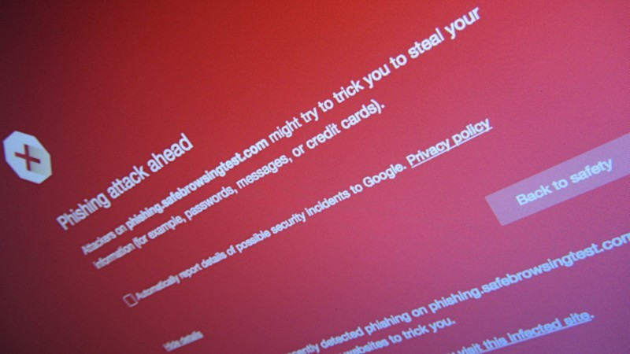

Várias relatos têm sido feitos nas redes sociais de pessoas que receberam um ou mais **SMS**, alegadamente do _**Montepio**_ ou do _**Banco BIC**_. As mensagens tratam-se, no entanto, de um ataque de _**phishing**_ pouco elaborado.

O conteúdo dos _SMS_ incentiva ao clique, indicando acesso inativo ao banco ou transações para receber. Os textos contêm erros ortográficos e hiperligações para endereços que não pertencem a qualquer das entidades bancárias. Para além disso, são enviadas de dois números de telemóvel.

Estes elementos são enormes _red flags_, pelo que, caso recebas alguma mensagem idêntica, sugerimos ignorares as ditas comunicações. Recomendamos que as reportes às autoridades, uma vez que constituem um [crime informático](http://cibercrime.ministeriopublico.pt/iframe/lei-do-cibercrime).

### O que é _phishing_?

_Phishing_ é um neologismo que deriva do inglês _fishing_ (pesca). O conceito é idêntico para as duas situações: a utilização de um “isco” para “apanhar” a vítima.

\[caption id="attachment\_251778" align="alignnone" width="800"\] Alerta de phishing - Autor: Christiaan Colen - Licença: [CC-BY-SA-2.0](https://creativecommons.org/licenses/by-sa/2.0/)\[/caption\]

Esta técnica de fraude _online_ consiste na utilização de métodos tecnológicos que levem os alvos a fornecer dados, direta ou indiretamente, pensando que estão a utilizar a plataforma usada para mascarar o ataque. Exemplos disso são as mensagens a que o artigo se refere. Olharam com atenção para a imagem em destaque? Reparem bem. Um dos endereços indicados é o mobmontepio.com. Como sabemos, esse não é o endereço _web_ do [_Montepio_](https://www.montepio.pt/particulares).

### É seguro clicar nas ligações?

 **Não! Não! E novamente não! Mais uma vez: não!** A forma de roubar informação pode não consistir necessariamente na inserção dos dados, por parte do utilizador, num _layout_ que normalmente é muito idêntico ao da entidade usada para mascarar o ataque. Esses endereços podem conter _malware_ que se aproveita de uma falha de segurança para instalar mais _malware_ nos vossos equipamentos, com o intuito de aceder à vossa informação.

Nunca se esqueçam que o [bom senso](https://espalhafactos.com/2017/01/02/efsecurity-cadeira-teclado-esta-das-chaves-da-seguranca/) é meio caminho andado para se protegerem.
