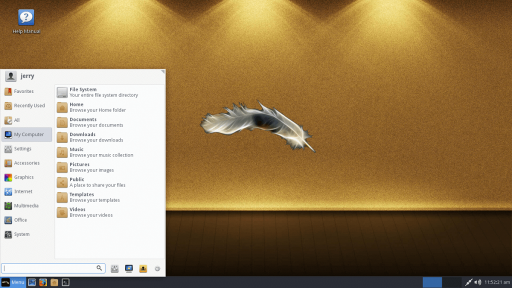
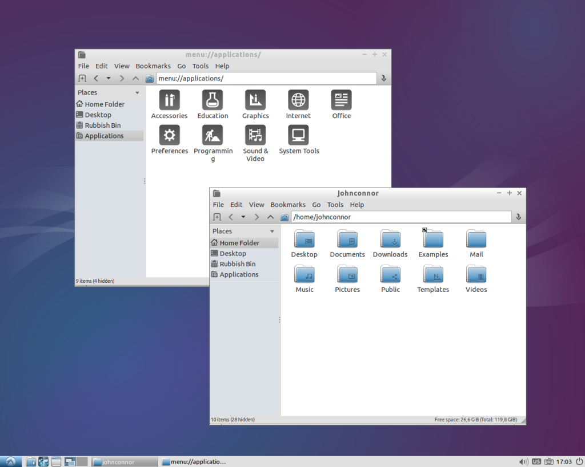
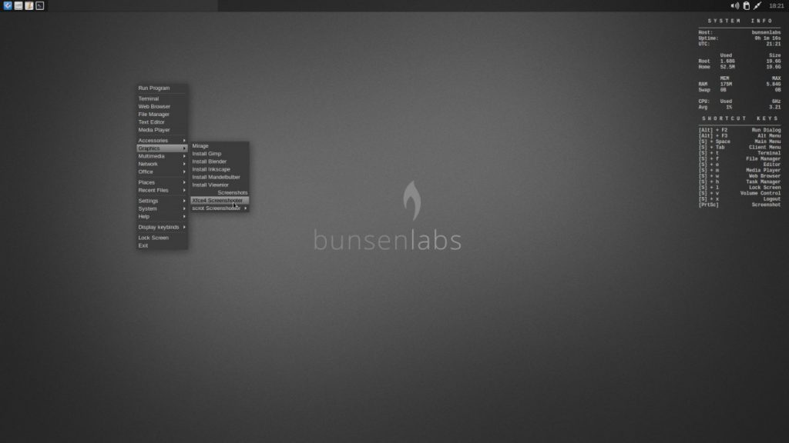

Um computador não fica inutilizável - ou cansado, como ouvi várias vezes - ao fim de três anos de utilização, a não ser que o _hardware_ esteja danificado. Muito menos tens que trocar obrigatoriamente de equipamento no fim desse período. O teu _desktop_ ou portátil pode ter muitos anos de uso pela frente. Tudo depende do sistema operativo que tenha instalado.

Hoje, vou apresentar-te três sistemas operativos que podem dar vida nova ao teu computador antigo e que te permitem realizar todas as tarefas que normalmente fazes com ele. Vais continuar a poder descarregar e/ou ver filmes, escrever documentos, editar imagens, ouvir música, jogar e tudo mais que faças com o computador. E não te preocupes, porque não tens que ser um _expert_ em informática para os instalares e utilizares.

Nalguns casos poderás notar que utilizam um _browser_ ou outra aplicação de que nunca ouviste falar. Isso é propositado. Como o objetivo é disponibilizar um sistema operativo mais "leve", é expectável que incluam aplicações que utilizem menos recursos. Isso não te impedirá, contudo, de instalares o Chrome ou outro _software_.

Sem mais demoras, os sistemas operativos:

#### _Linux Lite_

\[caption id="attachment\_254366" align="alignnone" width="1024"\] Imagem do desktop do Linux Lite\[/caption\]

Este projeto pretende facilitar a transição de _Windows_ para _Linux_. Ele é baseado em _Ubuntu_, mas contém várias alterações que o tornam ideal para equipamentos mais antigos. Uma delas é o ambiente gráfico, que é mais "leve", sem sacrificar funcionalidades, e é idêntico ao do sistema operativo da _Microsoft_.

Os requisitos mínimos são:

- processador de 700MHz;
- 512Mb de RAM;
- ecrã com resolução de 1024x768 pixeis;
- 8Gb de espaço em disco.

O _hardware_ necessário não é nada de extraordinário. Posso dizer-te que o instalei num _Magalhães_ de primeira geração, que utiliza uma pen _USB_ como armazenamento porque o disco foi à vida, e ele corre bem.

\[su\_button url="https://www.linuxliteos.com/download.php" target="blank" style="flat" icon="icon: cloud-download" text\_shadow="0px 0px 2px #000000aa" rel="nofollow"\]Download\[/su\_button\]

#### _Lubuntu_

\[caption id="attachment\_254365" align="alignnone" width="1024"\] Imagem do desktop do Lubuntu\[/caption\]

O _Lubuntu_ é uma edição oficial do _Ubuntu_ que, tal como o _Linux Lite_, recorre a um ambiente gráfico menos "pesado" e também ele com um aspeto idêntico ao do _Windows_.

Os requisitos mínimos são:

- processador Pentium 4, Pentium M ou AMD K8;
- 512Mb de RAM;
- 8Gb de espaço em disco.

É possível instalar o _Lubuntu_ num computador com menos de 512Mb de RAM. A performance, no entanto, ficará um pouco aquém das expectativas.

\[su\_button url="http://lubuntu.me/downloads/" target="blank" style="flat" icon="icon: cloud-download" text\_shadow="0px 0px 2px #000000aa" rel="nofollow"\]Download\[/su\_button\]

#### _Bunsenlabs_

\[caption id="attachment\_254367" align="alignnone" width="1024"\] Imagem do desktop do Bunsenlabs\[/caption\]

Este sistema operativo é mais "leve" que os anteriores. A base é _Debian_, por isso tem acesso a imenso _software_, mas o ambiente gráfico é um pouco diferente do habitual. É esta particularidade que torna o _Busenlabs_ o peso pluma desta lista.

Os requisitos mínimos são:

- processador Pentium 4, Pentium M ou AMD K8;
- 256Mb de RAM;
- 10Gb de espaço em disco.

Como o ambiente gráfico é atípico para quem vem de _Windows_, é recomendado que leias a breve [introdução](https://forums.bunsenlabs.org/viewtopic.php?id=1892) disponível no fórum do projeto.

\[su\_button url="https://www.bunsenlabs.org/installation.html#downloads" target="blank" style="flat" icon="icon: cloud-download" text\_shadow="0px 0px 2px #000000aa" rel="nofollow"\]Download\[/su\_button\]

### Conclusão

Estas três sugestões são algumas das muitas opções que tens ao teu dispor. Tudo depende do _hardware,_ da utilização pretendida e, em certa medida, do _know-how_. Por exemplo, como precisava de um repositório [_Git_](https://git-scm.com/) local (em casa) para _backup_ de alguns trabalhos, reaproveitei um _Pentium III_, com 1Gb de RAM, instalei-lhe [_Debian_](https://debian.org) sem ambiente gráfico, [_SSH_](https://pt.wikipedia.org/wiki/Secure_Shell) para acesso remoto e o _Git_. Podia, no entanto, ter utilizado qualquer uma das opções mencionadas neste artigo.

Se estiveres interessado em dar uma oportunidade a algum destes sistemas operativos, podes testá-lo sem instalar. Basta, para isso, que descarregues o ficheiro com extensão "iso" e utilizes o [_Rufus_](https://rufus.akeo.ie/) para o escrever para uma _pen_ USB. Depois, só tens que forçar o computador a arrancar pela _pen_. Mais fácil ainda: grava o "iso" para um DVD e coloca o computador a arrancar primeiro pelo leitor.

Assim, o sistema operativo é inicializado sem teres que o instalar. Se gostares, só tens que abrir o instalador que está no ambiente de trabalho e iniciar o processo de instalação.
