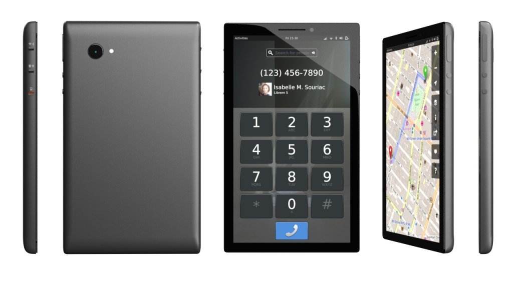

A [especulação](https://espalhafactos.com/2017/07/30/purism-telemovel-linux-puro/) terminou. A _**Purism**_, empresa que comercializa computadores com foco em software livre e de código aberto, vai mesmo lançar um _smartphone_ com _**Linux**_ "puro" e já iniciou a [**campanha de _crowdfunding_**](https://puri.sm/shop/librem-5/) para tornar o projeto realidade.

Seguindo a metodologia usada para os seus portáteis, a norte-americana _Purism_ iniciou uma campanha de _crowdfunding_ que pretende recolher fundos para o desenvolvimento de um _smartphone_ com _Linux_ "tradicional". O objetivo é arrecadar milhão e meio de dólares nos próximos sessenta dias, e disponibilizar o _Librem 5_ - nome escolhido para o equipamento - no primeiro trimestre de 2019.

O custo do equipamento é de 599 dólares (sensivelmente €508). Os interessados que contribuírem com 1399 dólares recebem, para além do _Librem 5_, um monitor de 24 polegadas, teclado e rato. Por 1699 dólares, o monitor passa a 30 polegadas.

A inclusão de opções com monitores, teclado e rato deve-se ao objetivo de convergência, isto é, poder utilizar o _smartphone_ também como um _desktop_, bastando para isso ligar-lhe o monitor e restantes periféricos.

\[caption id="attachment\_270123" align="alignnone" width="1024"\] Esta é a possível estética do Librem 5\[/caption\]

### Hardware

A escolha de _hardware_ que vai equipar o _Librem 5_ ainda não está finalizada. A _SoC_ _i.MX6_, lançada em 2011, ou a _i.MX8_, que ainda está em desenvolvimento, são as possíveis escolhas para a integração dos circuitos, que será acompanhada por _3GB_ de _RAM_ e _32GB_ de armazenamento _eMMC_. Nas redes móveis, terá suporte para _2G_, _3G_ e _4G_ (_LTE_), e contará ainda com _WiFi_ e _Bluetooth 4.0_.

Dado o foco na privacidade, este _smartphone_ terá, tal como acontece nos portáteis da marca, um sistema de _kill switch_ - isto é, botões físicos ativar e desativar componentes - para o _WiFi_, _Bluetooth_ e rede móvel.

Do ecrã, o que se sabe para já é que terá 5 polegadas.

### Software

O software do _Librem 5_ não será _Android_ nem uma distribuição de _Linux_ largamente baseada no projeto da _Google_. A _Purism_ opta por utilizar uma distribuição dita normal, servindo como base para o desenvolvimento de uma plataforma de convergência para todos os equipamentos (portáteis e agora também _smartphones_) que comercializa.

Esta distribuição chama-se [_PureOS_](https://pureos.net/) e é baseada em [_Debian Linux_](https://espalhafactos.com/2017/06/21/nova-versao-debian-disponivel/). Este é o mesmo sistema operativo que a _Purism_ utiliza nos seus portáteis. O código-fonte está disponível, seguindo o apanágio e modelo de negócio da empresa.

O _Librem 5_, contudo, não estará restrito ao _PureOS_. Os utilizadores poderão instalar qualquer outra distribuição que suporte a arquitetura da _SoC_, [_ARM_](https://developer.arm.com/products/architecture).

No interface gráfico, a opção recai para já nas tecnologias [_GNOME/GTK_](https://www.gnome.org/). As imagens publicadas pela empresa sugerem uma versão da [_GNOME Shell_](https://wiki.gnome.org/Projects/GnomeShell) adaptada às 5 polegadas do ecrã. Esta escolha deverá tornar a plataforma familiar para os utilizadores de Linux.

Deixamos-te com o vídeo promocional da campanha.

\[embed\]https://videos.puri.sm/promo/l5-campaign.mp4\[/embed\]
