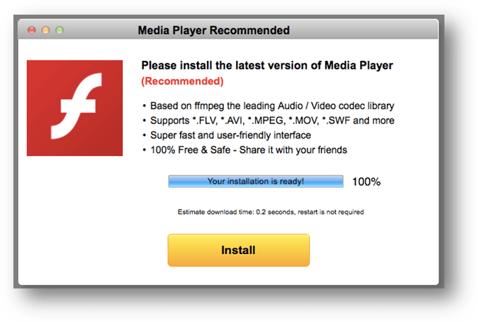

O _**Facebook**_ _**Messenger**_ está a ser utilizado numa campanha de difusão de _adware_, um tipo de _malware_ que força a apresentação de publicidade que é monetizada pelo(s) autor(es) da aplicação maliciosa, e que afeta os utilizadores de _Linux_, _macOS_ e _Windows_.

A [descoberta](https://securelist.com/new-multi-platform-malwareadware-spreading-via-facebook-messenger/81590/) foi feita por um investigador do _Karspersky Lab_, David Jacoby, quando recebeu uma mensagem - que considerou suspeita - de um dos seus contactos do _Facebook_. Nessa mensagem, era apresentada uma _link_ e um texto que sugeria que se tratava de um vídeo sobre David.

\[caption id="attachment\_270319" align="aligncenter" width="416"\] A mensagem que David recebeu\[/caption\]

Ao analisar a mensagem, deparou-se com uma campanha de _adware_ multiplataforma, isto é, que afeta vários sistemas operativos. A hiperligação da mensagem, encurtada através do _Bit.ly_, encaminha o utilizador para um '_Google Doc'_ com uma imagem que tenta simular um vídeo. Quando é clicada, o utilizador é redirecionado para uma página onde é apresentada informação do seu sistema. Essa página encaminha novamente o utilizador, desta vez para um _download_.

\[caption id="attachment\_270320" align="alignnone" width="939"\] O 'Google Doc' com o vídeo falso\[/caption\]

O download é dependente do sistema operativo e _browser_ utilizados, e pode ser uma aplicação ou uma extensão para o _browser_. Por exemplo, um utilizador de _Windows_ e _Firefox_ vai receber um ficheiro diferente de um utilizador de _Windows_ e _Chrome_.

Os utilizadores de _Linux_ e _macOS_ não estão imunes. Também lhes são apresentadas aplicações ou extensões maliciosas, compatíveis com os seus sistemas operativos, para _download_.

\[caption id="attachment\_270330" align="alignnone" width="783"\] Uma das opções de download do adware\[/caption\]

Ainda não há confirmação sobre a forma como os autores desta campanha estarão a difundir o _malware_. Uma das hipóteses é a utilização de contas previamente comprometidas.

Para não caíres vítima deste _adware_, recomendamos os [habituais cuidados](https://espalhafactos.com/2017/01/02/efsecurity-cadeira-teclado-esta-das-chaves-da-seguranca/), como não clicar em todas as hiperligações, mesmo que sejam enviadas por um contacto, e manter o antivírus atualizado.
