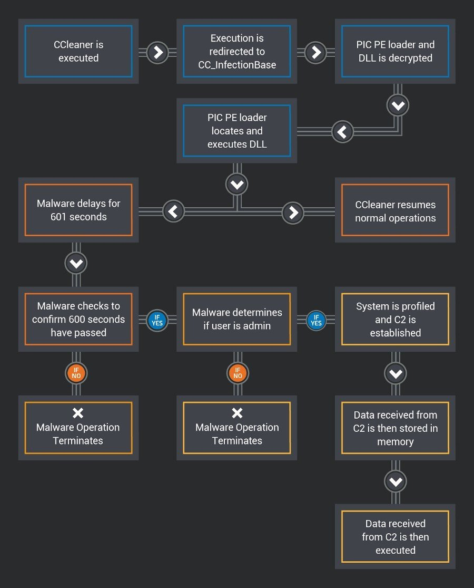

Entre 15 de agosto e 12 de setembro, cibercriminosos conseguiram inserir código malicioso no **_Ccleaner_**, impactando novas instalações e atualizações.

A descoberta foi feita por investigadores de segurança informática da [_Cisco Talos_](http://blog.talosintelligence.com/2017/09/avast-distributes-malware.html). Um ou mais cibercriminosos realizaram ataques informáticos à _Piriform_, empresa que desenvolve este utilitário, e substituíram a aplicação legítima por uma infetada com _software_ malicioso. A versão adulterada foi distribuída durante quase um mês.

\[caption id="attachment\_272469" align="alignnone" width="900"\] Como funciona o malware incluído no Ccleaner\[/caption\]

Esta ameaça afeta os utilizadores que instalaram o _Ccleaner_ _\[versão 5.33.x\]_ entre 15 de agosto e 12 de setembro, mas também todos os que o tinham instalado anteriormente e o atualizaram durante o período de tempo acima mencionado. O número de infeções poderá ultrapassar os 20 milhões (5 milhões/semana x 4 semanas), de acordo com os investigadores.

> The impact of this attack could be severe given the extremely high number of systems possibly affected. CCleaner claims to have over 2 billion downloads worldwide as of November 2016 and is reportedly adding new users at a rate of 5 million a week.

Sabe-se que o _malware_ utilizado rouba informação dos computadores infetados e a envia para servidores remotos usados pelos atacantes. Também, a versão maliciosa tinha uma assinatura digital válida emitida pela _Symantec_ à [_Piriform_](http://www.piriform.com/news/blog/2017/9/18/security-notification-for-ccleaner-v5336162-and-ccleaner-cloud-v1073191-for-32-bit-windows-users), o que, de acordo com os investigadores, poderá indicar que o responsável ou responsáveis pelo ataque comprometeram computadores utilizados para o desenvolvimento da aplicação.

##### Lê também: [EFSecurity: Entre a cadeira e o teclado está uma das chaves da segurança](https://espalhafactos.com/2017/01/02/efsecurity-cadeira-teclado-esta-das-chaves-da-seguranca/)

Se utilizas esta aplicação e a instalaste ou atualizaste durante 15 de agosto de 12 de setembro, atualiza o anti-vírus e coloca-o a fazer uma verificação completa. Também, instala ou atualiza para a versão mais recente do _Ccleaner_ _\[versão 5.34\]_, uma vez que esta já não contém o código malicioso. No entanto, é possível que estes passos não removam o _malware_ do teu computador e te obrigue a reinstalar o sistema operativo.
