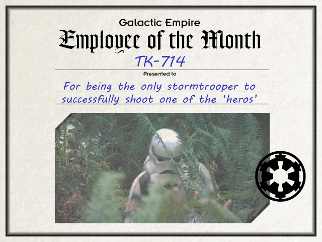

Há quase um ano, [publicámos](https://espalhafactos.com/2017/01/04/sera-que-deves-confiar-rankings-app-stores/) um artigo no **_Espalha Factos_** sobre os problemas das _app stores_. No texto, uma das questões que abordámos foi os _rankings_ das _apps_, alertando para a existência de serviços à venda no site _Taobao_ que alegam conseguir colocar uma aplicação no _top10_ por 11 mil dólares.

Este problema é a ponta do _iceberg_. Há outros mais gravosos. Um deles é a existência de aplicações falsas que se fazem passar por outras populares, e que são usadas para distribuir _malware_.

A revista _Forbes_ [publicou](https://www.forbes.com/sites/thomasbrewster/2017/11/06/google-whatsapp-fake-problem-is-big/#6901cfe7597d) recentemente um artigo na edição _online_ em que dá um exemplo: um clone malicioso do _Whatsapp_ na _Play Store_. Numa semana, a aplicação falsa - que conta com imensas _reviews_, também elas falsas - foi descarregada por mais de um milhão de utilizadores.

#### Como acontece

Como pode isto acontecer? A _Google_ tem sistemas que verificam frequentemente, de forma automática, as aplicações disponíveis. A _Apple_ e a _Microsoft_ terão certamente algo idêntico.

Isto ocorre porque, pelo menos na _Play Store_, é possível alguém criar uma conta com o nome de autor muito idêntico a outra já existente, bastando para isso adicionar um ou mais espaços, ou um ou mais caracteres [_unicode_](http://www.unicode.org/), ao nome. Tendo a conta criada, é possível usar facilmente os mesmos _screenshots_ e ícone da aplicação fidedigna, inclusive o mesmo nome - como poderão ver pelas imagens [publicadas](https://twitter.com/LukasStefanko/status/927225994657828864/photo/1) no _Twitter_ pelo investigador de segurança informática **Lukas Stefanko**, e que reproduzimos aqui.

\[su\_custom\_gallery source="media: 277341,277342" limit="2" link="lightbox" width="290" height="560" title="always"\]\[su\_custom\_gallery source="media: 196375,196380,196379,196378,196377,196376" link="custom" width="800" height="400" title="never"\]\[/su\_custom\_gallery\]

Vamos usar o _Whatsapp_ como exemplo. No nome do autor da aplicação fidedigna aparece-nos “_WhatsApp Inc._”. Os vários clones maliciosos que existem utilizam nomes de autor idênticos, como “_WhatsApp Inc. ._” \[repara nos espaços entre os dois pontos\] ou “_WhatsApp Inc !!!._” \[esta deve trazer mais animação, com tanto ponto de exclamação\].

Este é um dos métodos utilizados para contornar o “sistema”. Outro é a inclusão do mínimo possível de funcionalidades maliciosas para evitar a deteção nos sistemas automáticos, sendo o restante código malicioso descarregado quando se abre a aplicação.

#### Como evitar

Para evitares estes clones maliciosos, há algumas _red flags_ a que deves estar atento. Primeiro, confirma se os nomes da aplicação e autor são corretos. No exemplo que te demos, o dos clones do _WhatsApp_, vários deles tinham o nome do autor e/ou da aplicação um pouco diferente do original, mas idêntico o suficiente para enganar os mais distraídos.

Outra medida que podes adotar é o acesso ao _site_ da aplicação, se souberes de antemão qual é, e confirmar se tem uma link para a _app_ na _App Store_ da tua plataforma móvel. Se tiver, segue o _link_ para confirmares se a aplicação que vais instalar é realmente a que queres e não um clone.

Não te esqueças que tu és a primeira linha de defesa e que estes clones, ao contrário dos da saga _Star Wars_, têm pontaria e causam estragos.

