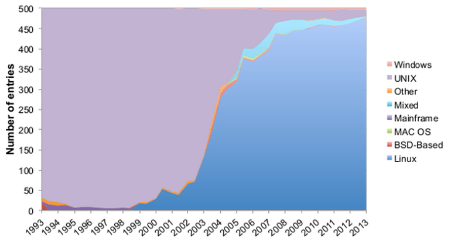

Há vários anos que **_Linux_** era o sistema operativo mais utilizado nos **500 supercomputadores mais rápidos do mundo**. Este mês, novembro, passou a dominar totalmente a lista.

Os dois equipamentos restantes do _top_ que não utilizavam _[Linux](https://kernel.org)_ perderam a posição na atualização de novembro. Estes equipamentos utilizavam _AIX_, uma implementação proprietária de _Unix_ desenvolvida pela _IBM_.

**A primeira vez que este sistema operativo surgiu na lista foi em 1998**, [cinco anos](https://www.top500.org/lists/2017/11/) (1993) depois do _top500_ dos supercomputadores começar a ser compilado. Nesta altura, _Unix_ era o "rei" da lista.

Em 2003, _Linux_ "roubou" o domínio do _Unix_ (e respetivas implementações). Nesse ano, _Unix_ começou a perder uma percentagem significativa de equipamentos, com o sistema operativo que tem um pinguim como mascote (conhecido por _Tux_) a subir exponencialmente.

##### [Lê também: Com que então… queres experimentar Linux?](https://espalhafactos.com/2017/01/20/entao-queres-experimentar-linux/)

**Sete anos depois do _boom_, em [junho de 2010](https://www.top500.org/lists/2010/06/), já era utilizado em mais de 90% dos 500 supercomputadores mais rápidos do mundo**.

O facto de ser um projeto _open source_ é um dos motivos apontados pela _Linux Foundation_ para o domínio nos supercomputadores, o que permite uma maior otimização para as tarefas de computação necessárias. Outro dos motivos prende-se com a escalabilidade do sistema operativo.

Linux é um _kernel_, um dos componentes mais importantes de um sistema operativo e o que faz a gestão do hardware dos equipamentos. Os sistemas operativos que utilizam este _kernel_ também são vulgarmente conhecidos como _Linux_ ou distribuições de _Linux_. _[Ubuntu](https://ubuntu.com)_, _[Debian](https://debian.org)_, _[Fedora](https://getfedora.org/)_, _[Arch](https://www.archlinux.org/)_ e _[Android](https://www.android.com/)_ são algumas das mais conhecidas. _[Caixa Mágica](https://caixamagica.pt/)_ e _[AçorOS](https://sourceforge.net/projects/acor-os/)_ são duas distribuições de origem nacional.

No _top500_, cinco supercomputadores utilizam _Ubuntu_, vinte têm _Red Hat Enterprise Linux_ e cento e nove recorrem a _CentOS_ (distribuição baseada na anterior). O primeiro da lista, o chinês _Sunway TaihuLight_, utiliza uma distribuição chamada _Sunway RaiseOS_ e que foi desenvolvida especificamente para ele.
