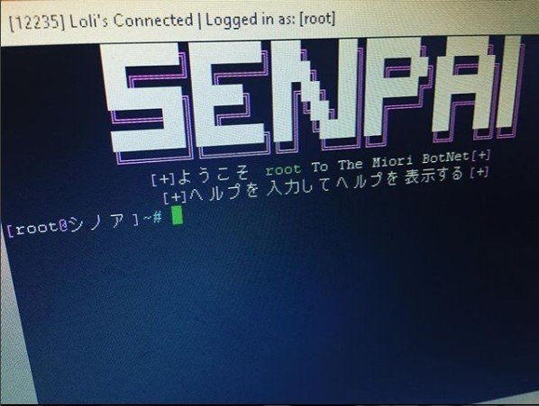

O **_Instagram_** está a ser usado por cibercriminosos como mercado para venda de credenciais roubadas e _botnets_. O alerta foi dado por **Joseph Cox**, da _[Mortherboard](https://motherboard.vice.com/en_us/article/43843w/hackers-are-selling-botnets-and-stolen-fortnite-accounts-over-instagram)_.

De acordo com o repórter, o _Instagram_, que agora é detido pelo **_Facebook_**, é um paraíso para os cibercriminosos. Para isso, contribuíram as conhecidas dificuldades da rede social, criada por Mark Zuckerberg, em moderar o conteúdo publicado nas suas plataformas. A alegada interferência nas eleições norte-americanas é um exemplo dessas dificuldades.

##### Lê também: [Facebook testa música em fotos e vídeos](https://espalhafactos.com/2018/09/28/facebook-testa-musica-em-fotos-e-videos/)

Os "bens" comercializados no _Instagram_ são _logins_ para o **_Spotify_** e **_Fortnite_**, bem como acesso a _botnets_ que podem ser usadas para atacar servidores, enviar _spam_ ou realizar outras atividades ilícitas. Os _logins_ para o jogo _Fortnite_ parecem ser de especial interesse para os seus clientes, dada a crescente popularidade do jogo e uma vez que algumas destas contas possuem _skins_ exclusivas e _upgrades_.

A forma como estas vendas são anunciadas revela as muitas dificuldades que o _Facebook_, e por conseguinte o _Instagram_, têm na moderação dos conteúdos publicados. Os cibercriminosos que usam a plataforma tanto anunciam o que têm para venda através de publicações normais, como usam as _stories_.

\[caption id="attachment\_340844" align="aligncenter" width="598"\] _Screenshot _de uma publicação a vender acesso a uma _botnet___\[/caption\]

A transição, por parte de alguns cibercriminosos, das plataformas da _Dark Web_ para as redes sociais poderá ser uma forma de chegarem a mais potenciais clientes, já que nem toda a gente tem _know-how_ ou vontade de aceder à _Dark Web_. A escolha do _Instagram_ como mercado poderá estar relacionada com a dificuldade que os moderadores da plataforma têm em fazer cumprir os seus [Termos de Utilização](https://web.archive.org/web/20181004155153/https://help.instagram.com/581066165581870?ref=dp), onde figura o seguinte:

> You can't do anything unlawful, misleading, or fraudulent or for an illegal or unauthorized purpose.

Esta situação já terá sido reportada ao _Instagram_. Estas contas, no entanto, continuam ativas à data de escrita deste artigo.

##### Lê também: [Sem tempo para ler? A biblioteca pública de Nova Iorque ajuda-te… no Instagram](https://espalhafactos.com/2018/08/24/sem-tempo-ler-biblioteca-nova-iorque-ajuda-instagram/)
