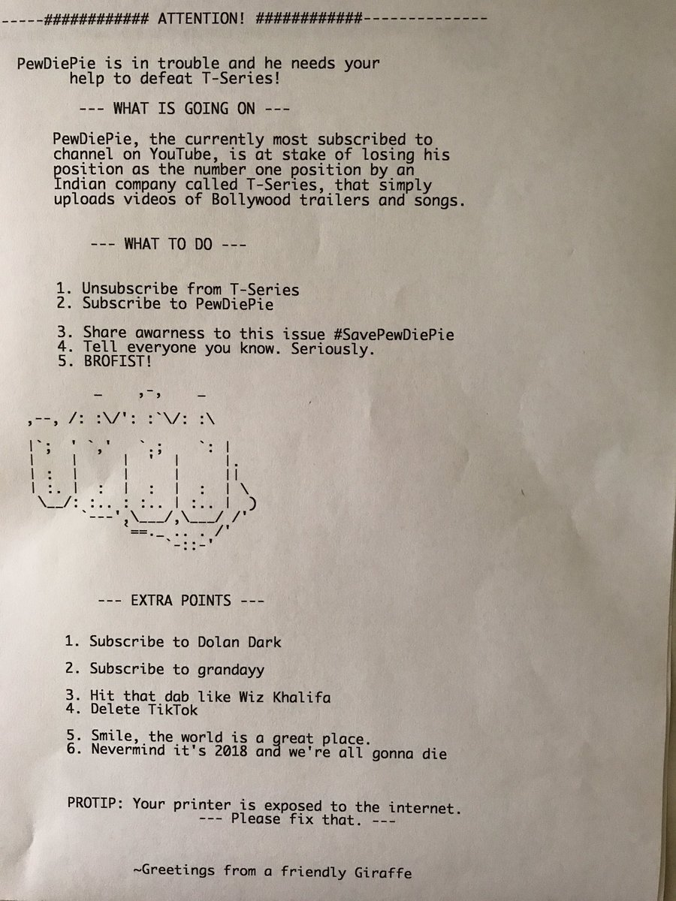

Um utilizador do _Twitter_, com o pseudónimo **_[@TheHackerGiraffe](https://twitter.com/HackerGiraffe)_**, é o alegado autor de um ataque informático que teve como alvo 50 mil impressoras. Os objetivos eram alertar para as falhas de segurança destes equipamentos e promover o _youtuber_ sueco **_PewDiePie_**.

O [_hack_](https://hacking-printers.net/wiki/index.php/Port_9100_printing) aconteceu no passado dia 29 de novembro e afetou vários tipos de impressoras, desde multifunções de gama alta a impressoras de recibos. Os únicos requisitos eram ter o equipamento ligada à _internet_, as "portas" de impressão expostas e utilizar _firmware_ antigo.

As impressoras que foram alvo do ataque imprimiram uma mensagem de promoção ao canal do _PewDiePie_, onde também se encorajava as "vítimas" a remover a subscrição do canal _T-Series_. Este canal chegou a ultrapassar o número de subscritores do _youtuber_ sueco e, por isso, gerou algumas picardias entre ambos.

\[caption id="attachment\_345067" align="alignnone" width="900"\] Foto da mensagem enviada pelo autor do ataque\[/caption\]

##### **Lê também: [EFSecurity: Entre a cadeira e o teclado está uma das chaves da segurança](https://espalhafactos.com/2017/01/02/efsecurity-cadeira-teclado-esta-das-chaves-da-seguranca/)**

No _Twitter_, o autor referiu que o ataque serviu para alertar para uma falha de segurança grave presente em várias impressoras e garantir que a segurança destes tipo de equipamentos é alvo de escrutínio a nível mundial.

Para encontrar os dispositivos vulneráveis foi utilizado o [_Shodan_](https://shodan.io), uma espécie de _Google_ para pesquisar dispositivos expostos online, afirmou o autor no _Twitter_. Aqui, referiu em entrevista ao site [_The Verge_](https://www.theverge.com/2018/11/30/18119576/pewdiepie-printer-hack-t-series-youtube), terá encontrado mais de 800 mil impressoras que poderiam ter sido alvo do ataque.

https://twitter.com/HackerGiraffe/status/1068762322519449600

Este hack teve alguma exposição online, com vários utilizadores a partilharem fotos das mensagens impressas pelas suas impressoras.

https://twitter.com/apex2504/status/1067512945322676230?ref\_src=twsrc%5Etfw

https://twitter.com/maddybenavente1/status/1068017390246600704?ref\_src=twsrc%5Etfw
