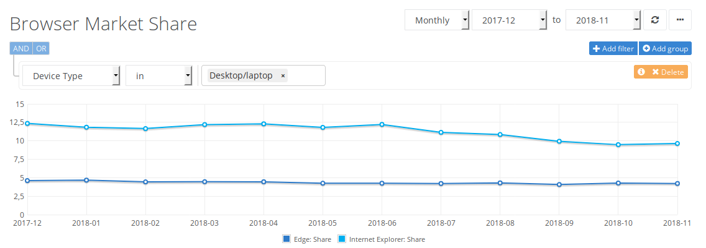

A **_Microsoft_** poderá descontinuar o **_Edge_**, o _browser_ que desenvolveu para substituir o _Internet Explorer_, e substituí-lo por um baseado no _Chromium_. A informação é avançada (4) pelo site _[WindowsCentral](https://www.windowscentral.com/microsoft-building-chromium-powered-web-browser-windows-10)_.

O _Edge_ foi o navegador que a _Microsoft_ lançou em 2015 para substituir o _Internet Explorer_. Inicialmente disponível como uma versão de teste, o _browser_ tinha vários problemas de performance e estabilidade, e acabou por não convencer os utilizadores.

##### Lê também: [Waterfox é um browser baseado no Firefox que aposta na performance](https://espalhafactos.com/2017/02/15/waterfox-um-browser-baseado-no-firefox-aposta-na-performance/)

Durante os três anos seguintes, a empresa de **Redmond** foi fazendo várias correções e atualizações, e inseriu várias funcionalidades como a sincronização entre dispositivos. Apesar das melhorias, as primeiras impressões sobre a aplicação terão sido mais fortes.

Isto traduziu-se numa percentagem de utilização abaixo dos 5% entre dezembro de 2017 e novembro deste ano (2018), de acordo com dados do [NetMarketShare](https://netmarketshare.com/browser-market-share.aspx?options=%7B%22filter%22%3A%7B%22%24or%22%3A%5B%7B%22deviceType%22%3A%7B%22%24in%22%3A%5B%22Desktop%2Flaptop%22%5D%7D%7D%5D%7D%2C%22dateLabel%22%3A%22Trend%22%2C%22attributes%22%3A%22share%22%2C%22group%22%3A%22browser%22%2C%22sort%22%3A%7B%22share%22%3A-1%7D%2C%22id%22%3A%22browsersDesktop%22%2C%22dateInterval%22%3A%22Monthly%22%2C%22dateStart%22%3A%222017-12%22%2C%22dateEnd%22%3A%222018-11%22%2C%22plotKeys%22%3A%5B%7B%22browser%22%3A%22Edge%22%7D%2C%7B%22browser%22%3A%22Internet%20Explorer%22%7D%5D%2C%22segments%22%3A%22-1000%22%7D). No mesmo período, o _Internet Explorer_ oscilou entre os 12,36% e os 9,64%.

\[caption id="attachment\_345168" align="aligncenter" width="1136"\] Estatísticas de utilização do Edge e do Internet Explorer. Dados do NetMarketShare.\[/caption\]

O reduzido número de utilizadores será o motivo para que a aplicação seja descontinuada.

##### Lê também: [EFSecurity: Como tornar o ‘browser’ mais seguro](https://espalhafactos.com/2016/12/03/tornar-browser-seguro/)

Para fazer frente ao _Google Chrome_, atualmente o _browser_ mais utilizado com uma quota de mercado superior a 60%, a _Microsoft_ estará a preparar um novo navegador baseado no _Chromium_. O _Chromium_ é a versão de código aberto do _Chrome_ e a base do _browser_ da **Google**. Ambos são desenvolvidos pela empresa sediada em Mountain View.

Este rumor ganhou força depois de terem sido identificados [alguns](https://chromium-review.googlesource.com/q/owner:Tom.Tan%2540microsoft.com) [_commits_](https://chromium-review.googlesource.com/q/owner:jkunkee%2540microsoft.com) (subsmissões de código), feitos por dois engenheiros da _Microsoft_, no repositório do _Chromium_.

Apesar de não haver ainda confirmação oficial por parte da _Microsoft_, é esperado que uma versão de teste do novo _browser_, com o nome de código **_Anaheim_**, seja disponibilizada na primeira metade de 2019.
