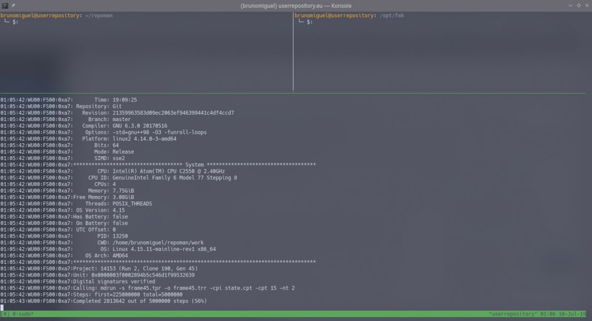

O [_**Folding@Home**_](http://foldingathome.org/) (_**F@h**_) é um projeto de computação distribuída, lançado a 1 de outubro de 2000, ao serviço da ciência. Ele conta com uma rede de voluntários de todo o mundo, que dispensam alguma da **capacidade de processamento** dos seus computadores pessoais, servidores virtuais (VPS) ou outras configurações, para computar várias dinâmicas moleculares de proteínas, ácido ribonucleico (ARN) e polímeros sintéticos.

Este conjunto de milhares de equipamentos permite aos investigadores desenvolver vacinas e estudar várias doenças como o Cancro da Mama ou dos Rins, Hepatite C e Alzheimer.

O projeto foi criado e continua a ter os seus destinos geridos pelo **_Pande Lab_**, um grupo de investigação científica do **Departamento de Química da Universidade de Stanford**, sob a supervisão do professor Vijay Pande.

### Como funciona o Folding@Home?

A aplicação - ou cliente - _c_orre em _background_ e utiliza o processador do computador quando este não está ocupado com outra(s) tarefa(s). Em alternativa, pode ser configurada para usar sempre o processador do computador, mesmo quando este está a processar outra informação.

O cliente recebe um conjunto de dados do servidor, que depois processa. Quando termina, devolve o resultado ao servidor e solicita novo conjunto de informação para computar.

Cada voluntário do _F@h_ pode escolher um nome de utilizador, que lhe permite, e à comunidade, seguir as estatísticas de contribuição. Também é possível escolher e criar equipas, que se dedicam a tarefas específicas relacionadas com as dinâmicas moleculares.

O programa está disponível para _GNU/Linux_, _macOS_ e _Windows._ Existe também algum trabalho desenvolvido pelo projeto para utilizar _GPUs_ (placas gráficas), _Playstation 3_ e até alguns _Sony Xperia_.

##### Lê também: [Huawei: Será o fim da guerra comercial com os EUA?](https://espalhafactos.com/2019/07/01/huawei-fim-do-bloqueio-comercial-de-trump/)

### Como podes ajudar?

Ajudar o _Folding@Home_ é tão simples como dar uma “sova no sofá”, diria. Precisas apenas de instalar a aplicação, correr o programa, escolher o nome de utilizador (este passo é facultativo) e a equipa. Só isto!

Quando está a ser executada, a aplicação aproveita os “tempos mortos” do teu computador e processa os dados que recebeu do servidor. Por exemplo, se estiveres a editar umas fotografias para partilhar no _Instagram_, o programa pausa o processamento de dados. Quando terminas - e se não fizeres mais nada a seguir -, ele retoma o processamento de dados.

\[caption id="attachment\_364734" align="aligncenter" width="1200"\] A minha VPS a aproveitar os "tempos mortos" para processar dados para o Folding@Home\[/caption\]

Eu tenho a minha _VPS_ a processar dados para este projeto, como podes ver na imagem acima. Quando não está ocupada com outras tarefas relacionadas com o repositório de aplicações para [_Manjaro_](https://manjaro.org), a distribuição de _GNU/Linux_ que uso de momento, que mantenho nela, usa dois dos processadores para a computação de dados.

Até ao momento, graças à contribuição dos voluntários, foram publicados 210 artigos científicos. Com a tua ajuda, podem ser publicados ainda mais!

### O que é dinâmica molecular

A dinâmica molecular é um método de simulação computacional, com mais de meio século de existência, para estudar o movimento das moléculas e as interações entre si. Este método é usado quando se conhece o potencial de interação dos objetos em estudo e as regras que regem o seu movimento. É também um método computacional muito "pesado", principalmente quando o nível de fidelidade dos resultados é elevado, daí a existência de projetos como o _Folding@Home_.
